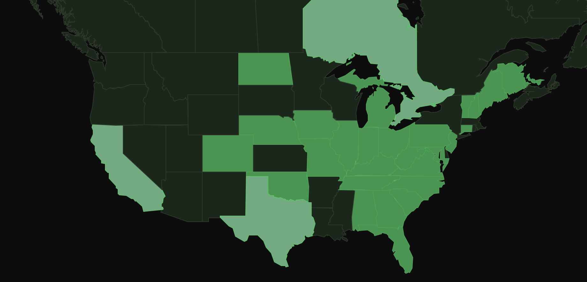

### W4TRC Wraps Up Field Day 2026

_June 28, 2026_

The Kingsport Amateur Radio Club wrapped up its 2026 ARRL Field Day operation this afternoon, closing out a successful 24-hour event with 122 QSOs across 42 ARRL sections.

**By the numbers**

|Metric|Result|
|---|---|
|Class|3A|
|Participants|9|
|Total QSOs|122|
|Phone contacts|102|
|CW contacts|20|
|Raw QSO points|142|
|Power multiplier|2× (100% battery)|
|Claimed QSO score|284|
|Bonus points|550|
|**Preliminary total**|**834**|
|ARRL sections worked|42 of 83|
|Bands active|40M, 20M, 15M|

**Bonus point breakdown**

| Bonus | Points |
|---|---|
| 100% emergency power | 300 |
| Public location | 100 |
| Social media | 100 |
| Entry submitted via web | 50 |
| **Total bonuses** | **550** |

**How the day went**

W4TRC fired up the station shortly after the 2:00 PM EDT start and got into a rhythm on 20 meters before shifting focus to 40M as the afternoon progressed. Saturday evening produced a solid run of contacts as band conditions cooperated, with operators trading chair time through the late evening hours.

After a quiet overnight, the club returned to the radios Sunday morning. The 10–11 AM EDT hour turned out to be the high-water mark of the entire event — 31 QSOs in a single hour as 40M opened up and the pileup stayed consistent.

CW was a welcome addition to the mix. Twenty contacts logged on 40M CW added meaningful points to the total, and it was great to see more club members getting comfortable on the key.

**Band breakdown**

| Band | CW | Phone |
|---|---|---|
| 40M | 20 | 50 |
| 20M | — | 47 |
| 15M | — | 5 |

Geographically, the log reached from Puerto Rico (PR) to North Dakota (ND), from Southern California (LAX) to Ontario (ON) and the Maritime provinces. 42 sections is solid coverage for a club Field Day operation.

**Operator roll call**

Thanks to the following members who sat in the chair:

- KO4DCD — 50 QSOs
- KR4ABN — 34 QSOs
- KD4FTN — 13 QSOs
- WX4ET — 12 QSOs
- KR4ABM — 6 QSOs
- N4JHC — 6 QSOs
- K0NG — 1 QSO
- KI6WDY — 1 QSO

Logs have been submitted to ARRL. Preliminary total score: **834 points** (284 QSO points + 550 bonus points).